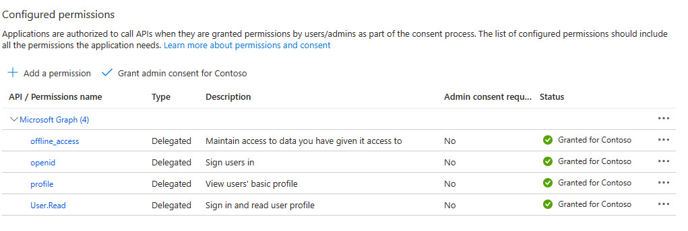
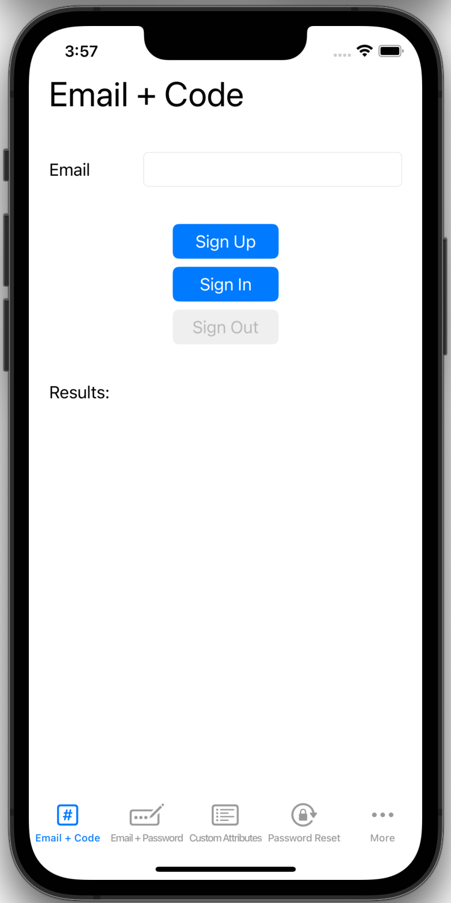
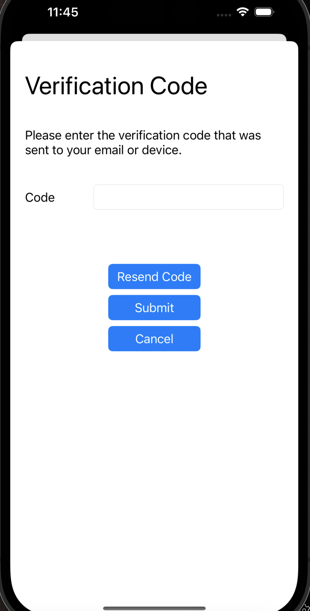

# How to run the iOS sample app

This guide demonstrates how to run an iOS sample application that showcases sign up, sign in, sign out and reset password scenarios using Microsoft Entra External ID for customers.

In this article, you learn how to:

- Register application in the Microsoft Entra External ID for customers.
- Enable public client flow.
- Create a sign in and sign out user flow in the Microsoft Entra External ID for customers.
- Associate your application with the user flow.
- Update a sample native iOS mobile application to use your own Microsoft Entra External ID for customers tenant details.
- Run and test the sample native iOS mobile application.

## Prerequisites

- <a href="https://developer.apple.com/xcode/resources/" target="_blank">Xcode</a>
- Microsoft Entra External ID for customers tenant. If you don't already have one, <a href="https://aka.ms/ciam-free-trial?wt.mc_id=ciamcustomertenantfreetrial_linkclick_content_cnl" target="_blank">sign up for a free trial</a>
- Fill <a href="https://forms.office.com/pages/responsepage.aspx?id=v4j5cvGGr0GRqy180BHbRw8Y1_5pVqVIgDSrZ25F6PdURFlMS0xSUkhETUU3MVVRQ1BZSUY4R1I5TC4u" target="">Enroll on CIAM Native Authentication Private Preview</a> form for us to allow-list tenant for native authentication. This may take up to 7 days. Alternatively, you can request a pre-created tenant from us that has been allowlisted using the same form.

## Register an application

To enable your application to sign in users with Microsoft Entra, Microsoft Entra External ID for customers must be made aware of the application you create. The app registration establishes a trust relationship between the app and Microsoft Entra. When you register an application, Microsoft Entra External ID generates a unique identifier known as an **Application (client) ID**, a value used to identify your app when creating authentication requests.

The following steps show you how to register your app in the Microsoft Entra admin center:

1. Sign in to the <a href="https://entra.microsoft.com/" target="_blank">Microsoft Entra admin center</a>.
1. If you have access to multiple tenants, make sure you use the directory that contains your Microsoft Entra External ID for customers tenant:

   1. Select the **Directories + subscriptions** icon  in the toolbar.
   1. On the **Portal settings | Directories + subscriptions** page, find your Microsoft Entra External ID for customers directory in the **Directory name** list, and then select **Switch**.

1. On the sidebar menu, select **Identity**.
1. Select **Applications** > **App Registrations**.
1. Select **+ New registration**.
1. In the **Register an application** page that appears;

   1. Enter a meaningful application **Name**, for example _ciam-client-app_.
   1. Under **Supported account types**, select **Accounts in this organizational directory only**.

1. Select **Register**.
1. The application's **Overview** pane will display upon successful registration. Record the **Directory (tenant) ID** and the **Application (client) ID** to be used in your application source code.

## Enable public client flow

To specify that this app is a public client, enable public client flow:

1. Under **Manage**, select **Authentication**.
1. Under **Advanced settings**, for **Enable the following mobile and desktop flows**, select **Yes**.
1. Select **Save** button.

## Grant API permissions

1. From the **App registrations** page, select the application that you created (such as _ciam-client-app_) to open its **Overview** page.
1. Under **Manage**, select **API permissions**.
1. Under **Configured permissions**, select **Add a permission**.
1. Select **Microsoft APIs** tab.
1. Under **Commonly used Microsoft APIs** section, select **Microsoft Graph**.
1. Select **Delegated permissions** option.
1. Under **Select permissions** section, search for and select **offline_access**, **openid**, and **profile** permissions.
1. Select the **Add permissions** button.
1. At this point, you've assigned the permissions correctly. However, since the tenant is a customer's tenant, the consumer users themselves can't consent to these permissions. You as the admin must consent to these permissions on behalf of all the users in the tenant:

   1. Select **Grant admin consent for <your tenant name>**, then select **Yes**.
   1. Select **Refresh**, then verify that **Granted for <your tenant name>** appears under **Status** for both scopes.

    

## Create a user flow

Follow these steps to create a user flow a customer can use to sign in or sign up for an application.

1. Sign in to the <a href="https://entra.microsoft.com/" target="_blank">Microsoft Entra admin center</a>.
1. If you have access to multiple tenants, make sure you use the directory that contains your Microsoft Entra External ID for customers tenant:

   1. Select the **Directories + subscriptions** icon  in the toolbar.
   1. On the **Portal settings | Directories + subscriptions** page, find your Microsoft Entra External ID for customers directory in the **Directory name** list, and then select **Switch**.

1. On the sidebar menu, select **Identity**.
1. Select **External Identities** > **User flows**.
1. Select **+ New user flow**.
1. On the **Create** page:

   1. Enter a **Name** for the user flow, such as _SignInSignUpSample_.
   1. In the **Identity providers** list, select **Email Accounts**. This identity provider allows users to sign in or sign up using their email address.
   1. Under **Email accounts**, you can select one of the two options. For this tutorial, select **Email one-time passcode**.

      - **Email with password**: Allows new users to sign up and sign in using an email address as the sign in name and a password as their first factor credential.
      - **Email one-time-passcode**: Allows new users to sign up and sign in using an email address as the sign in name and email one-time passcode as their first factor credential.

        > [!NOTE]
        > Email one-time passcode must be enabled at the tenant level (**All Identity Providers** > **Email one-time passcode**) for this option to be available at the user flow level.

   1. Skip **User attributes**.

1. Select **Create**. The new user flow appears in the **User flows** list. If necessary, refresh the page.

## Associate the application with the user flow

Although many applications can be associated with your user flow, a single application can only be associated with one user flow. A user flow allows configuration of the user experience for specific applications. For example, you can configure a user flow that requires users to sign in or sign up with an email address.

1. On the sidebar menu, select **Identity**.
1. Select **External Identities**, then **User flows**.
1. In the **User flows** page, select the **User flow name** you created earlier, for example, _SignInSignUpSample_.
1. Under **Use**, select **Applications**.
1. Select **Add application**.
1. Select the application from the list such as _ciam-client-app_ or use the search box to find the application, and then select it.

1. Choose **Select**.

## Clone sample iOS mobile application

1. Open Terminal and navigate to a directory where you want to keep the code.
1. Clone the iOS mobile application from GitHub by running the following command:

   ```bash
   git clone https://github.com/AzureAD/msal-objc-native-auth-preview.git
   ```

    > [!NOTE]
    > When prompted for your password, enter your GitHub personal access token instead of a password. Fore more information about personal access tokens, see <a href="https://docs.github.com/en/authentication/keeping-your-account-and-data-secure/managing-your-personal-access-tokens" target="_blank">managing your personal access tokens</a>.
.

1. Navigate to the directory where the repo was cloned:

   ```bash
   cd msal-objc-native-auth-preview
   ```

1. Install the dependencies:

   ```bash
   git submodule update --init
   ```

## Configure the sample iOS mobile application

1. In Xcode, open _msal-objc-native-auth-preview/Samples/ios-native-auth/NativeAuthSampleApp/NativeAuthSampleApp_ project.
1. Open _msal-objc-native-auth-preview/Samples/ios-native-auth/NativeAuthSampleApp/NativeAuthSampleApp/Configuration.swift_ file.
1. Find the placeholder:

   1. `Enter_the_Application_Id_Here` and replace it with the **Application (client) ID** of the app you registered earlier.
   1. `Enter_the_Tenant_Subdomain_Here` and replace it with the Directory (tenant) subdomain. For example, if your tenant primary domain is `contoso.onmicrosoft.com`, use contoso. If you don't have your tenant subdomain, learn how to [read your tenant details](https://learn.microsoft.com/azure/active-directory/external-identities/customers/how-to-create-customer-tenant-portal#get-the-customer-tenant-details).

> [!NOTE]
> Remember to select a scheme to build and destination where you run the built products. Each scheme contains a list of real or simulated devices that represent the available destinations.

## Run and test sample iOS mobile application

To build and run your code, select **Run** from the **Product** menu in Xcode. After a successful build, Xcode will launch the sample app in the Simulator.



This guide tests **Email one-time-passcode** usage. Enter a valid email address, select **Sign Up**, and launch the submit code screen:



After you enter your email address on the previous screen, the application will send a verification code to it. Once you submit the received code, the application will take you back to the previous screen and automatically sign you in. 

## Other flows

The sample app supports the following flows:

1. _Email + one-time passcode_: Follow this flow to sign in or sign up with an email and a one-time passcode.
1. _Email + password_: Follow this flow to sign in or sign up with email and a password.
1. _Email + password sign up with custom attributes_: Follow this flow to sign up with email, password and custom attributes.
1. _Password reset_: Follow this flow to reset the password.
1. _Fallback to web browser_: Follow this flow to use the browser to sign in or sign up.

    > [!NOTE]
    > In the [Create a user flow](#create-a-user-flow) section, you created a user flow where you chose **Email one-time passcode** under **Identity providers** > **Email Accounts**. For flows 2 through 4, you require a user flow that uses **Email with password** under **Identity providers** > **Email Accounts**.

Follow the steps in [Create a user flow](#create-a-user-flow) to create a user flow that uses **Email with password** under **Identity providers** > **Email Accounts**. Remember to [associate the application with the new user flow](#associate-the-application-with-the-user-flow)

After linking your application with the new user flow, run the application and use the bottom navigation to select different flows for testing.