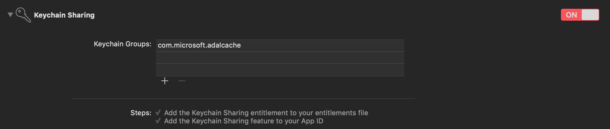

Microsoft Authentication Library for iOS and macOS
=====================================

| [Get Started](https://learn.microsoft.com/en-us/azure/active-directory/develop/mobile-app-quickstart?pivots=devlang-ios) | [iOS Sample Code](https://github.com/Azure-Samples/active-directory-ios-swift-native-v2) | [macOS Sample Code](https://github.com/Azure-Samples/active-directory-macOS-swift-native-v2) | [<u>B2C Sample Code</u>](https://github.com/Azure-Samples/active-directory-b2c-ios-swift-native-msal) | [Library reference](https://azuread.github.io/microsoft-authentication-library-for-objc/) | [Support](https://github.com/AzureAD/microsoft-authentication-library-for-objc/blob/dev/README.md#community-help-and-support) | [Feedback](https://forms.office.com/r/xuBV0CzEih)
| --- | --- | --- | --- | --- | --- | --- | 

The MSAL library for iOS and macOS gives your app the ability to begin using the [Microsoft Identity platform](https://aka.ms/aaddev) by supporting [Azure Active Directory](https://azure.microsoft.com/en-us/services/active-directory/) and [Microsoft Accounts](https://account.microsoft.com) in a converged experience using industry standard OAuth2 and OpenID Connect. The library also supports [Azure AD B2C](https://azure.microsoft.com/services/active-directory-b2c/) for those using our hosted identity management service.

## Quick sample

#### Swift
```swift
let config = MSALPublicClientApplicationConfig(clientId: "<your-client-id-here>")
let scopes = ["your-scope1-here", "your-scope2-here"]
        
if let application = try? MSALPublicClientApplication(configuration: config) {
            
	#if os(iOS)
	let viewController = ... // Pass a reference to the view controller that should be used when getting a token interactively
	let webviewParameters = MSALWebviewParameters(authPresentationViewController: viewController)
	#else
	let webviewParameters = MSALWebviewParameters()
	#endif
	
	let interactiveParameters = MSALInteractiveTokenParameters(scopes: scopes, webviewParameters: webviewParameters)
	application.acquireToken(with: interactiveParameters, completionBlock: { (result, error) in
                
	guard let authResult = result, error == nil else {
		print(error!.localizedDescription)
		return
	}
                
	// Get access token from result
	let accessToken = authResult.accessToken
                
	// You'll want to get the account identifier to retrieve and reuse the account for later acquireToken calls
	let accountIdentifier = authResult.account.identifier
	})
}
else {
	print("Unable to create application.")
}
```

#### Objective-C
```obj-c
NSError *msalError = nil;
    
MSALPublicClientApplicationConfig *config = [[MSALPublicClientApplicationConfig alloc] initWithClientId:@"<your-client-id-here>"];
NSArray<NSString *> *scopes = @[@"your-scope1-here", @"your-scope2-here"];
    
MSALPublicClientApplication *application = [[MSALPublicClientApplication alloc] initWithConfiguration:config error:&msalError];
    
#if TARGET_OS_IPHONE
    UIViewController *viewController = ...; // Pass a reference to the view controller that should be used when getting a token interactively
    MSALWebviewParameters *webParameters = [[MSALWebviewParameters alloc] initWithAuthPresentationViewController:viewController];
#else
    MSALWebviewParameters *webParameters = [MSALWebviewParameters new];
#endif
    
MSALInteractiveTokenParameters *interactiveParams = [[MSALInteractiveTokenParameters alloc] initWithScopes:scopes webviewParameters:webParameters];
[application acquireTokenWithParameters:interactiveParams completionBlock:^(MSALResult *result, NSError *error) {
    if (!error)
    {
        // You'll want to get the account identifier to retrieve and reuse the account
        // for later acquireToken calls
        NSString *accountIdentifier = result.account.identifier;
            
        NSString *accessToken = result.accessToken;
    }
    else
    {
        // Check the error
    }
}];
```

## Master branch deprercation
The master branch has been copied over to main branch. The master branch will contain updates only until version 1.2.14, for further releases please refer to 'main' branch instead of 'master'.

## Installation
### Using CocoaPods

You can use [CocoaPods](http://cocoapods.org/) to install `MSAL` by adding it to your `Podfile` under target:

```
use_frameworks!
 
target 'your-target-here' do
	pod 'MSAL'
end
```

### Using Carthage

You can use [Carthage](https://github.com/Carthage/Carthage) to install `MSAL` by adding it to your `Cartfile`: 

```
github "AzureAD/microsoft-authentication-library-for-objc" "main"
```
### Using Swift Packages

You can add `MSAL` as a [swift package dependency](https://developer.apple.com/documentation/swift_packages/distributing_binary_frameworks_as_swift_packages).
For MSAL version 1.1.14 and above, distribution of MSAL binary framework as a Swift package is available.

1. For your project in Xcode, click File → Swift Packages → Add Package Dependency...
2. Choose project to add dependency in
3. Enter : https://github.com/AzureAD/microsoft-authentication-library-for-objc as the package repository URL
4. Choose package options with :
    1. Rules → Branch : main (For latest MSAL release)
    2. Rules → Version → Exact : [release version >= 1.1.14] (For a particular release version)

For any issues, please check if there is an outstanding SPM/Xcode bug.
Workarounds for some bugs we encountered :
* If you have a plugin in your project you might encounter [CFBundleIdentifier collision. Each bundle must have a unique bundle identifier](https://github.com/AzureAD/microsoft-authentication-library-for-objc/issues/737#issuecomment-767311138) error. [Workaround](https://github.com/AzureAD/microsoft-authentication-library-for-objc/issues/737#issuecomment-767990771)
* While archiving, error : “IPA processing failed” UserInfo={NSLocalizedDescription=IPA processing failed}. [Workaround](https://github.com/AzureAD/microsoft-authentication-library-for-objc/issues/737#issuecomment-767990771)
* For a macOS app, “Command CodeSign failed with a nonzero exit code” error. [Workaround](https://github.com/AzureAD/microsoft-authentication-library-for-objc/issues/737#issuecomment-770056675)

### Manually

You can also use Git Submodule or check out the latest release and use as framework in your application.


## Configuring MSAL

### Adding MSAL to your project
1. Register your app in the [Azure portal](https://aka.ms/MobileAppReg)
2. Make sure you register a redirect URI for your application. It should be in the following format: 

 `msauth.$(PRODUCT_BUNDLE_IDENTIFIER)://auth`

3. Add a new keychain group to your project Capabilities. Keychain group should be `com.microsoft.adalcache` on iOS and `com.microsoft.identity.universalstorage` on macOS. 



See more information about [keychain groups](https://docs.microsoft.com/en-us/azure/active-directory/develop/howto-v2-keychain-objc) and [Silent SSO for MSAL](https://docs.microsoft.com/en-us/azure/active-directory/develop/single-sign-on-macos-ios).

#### iOS only steps:

1. Add your application's redirect URI scheme to your `Info.plist` file

```xml
<key>CFBundleURLTypes</key>
<array>
    <dict>
        <key>CFBundleURLSchemes</key>
        <array>
            <string>msauth.$(PRODUCT_BUNDLE_IDENTIFIER)</string>
        </array>
    </dict>
</array>
```
2. Add `LSApplicationQueriesSchemes` to allow making call to Microsoft Authenticator if installed.

Note that “msauthv3” scheme is needed when compiling your app with Xcode 11 and later. 

```xml
<key>LSApplicationQueriesSchemes</key>
<array>
	<string>msauthv2</string>
	<string>msauthv3</string>
</array>
```
See more info about [configuring redirect uri for MSAL](https://docs.microsoft.com/en-us/azure/active-directory/develop/reply-url)

3. To handle a callback, add the following to `appDelegate`:

#### Swift
```swift
func application(_ app: UIApplication, open url: URL, options: [UIApplication.OpenURLOptionsKey : Any] = [:]) -> Bool {
        
	return MSALPublicClientApplication.handleMSALResponse(url, sourceApplication: options[UIApplication.OpenURLOptionsKey.sourceApplication] as? String)
}
```

#### Objective-C
```obj-c
- (BOOL)application:(UIApplication *)app
            openURL:(NSURL *)url
            options:(NSDictionary<UIApplicationOpenURLOptionsKey,id> *)options
{
    return [MSALPublicClientApplication handleMSALResponse:url 
                                         sourceApplication:options[UIApplicationOpenURLOptionsSourceApplicationKey]];
}
```

**Note, that if you adopted UISceneDelegate on iOS 13+**, MSAL callback needs to be placed into the appropriate delegate method of UISceneDelegate instead of AppDelegate. MSAL `handleMSALResponse:sourceApplication:` must be called only once for each URL. If you support both UISceneDelegate and UIApplicationDelegate for compatibility with older iOS, MSAL callback would need to be placed into both files.

#### Swift
```swift
func scene(_ scene: UIScene, openURLContexts URLContexts: Set<UIOpenURLContext>) {
        
        guard let urlContext = URLContexts.first else {
            return
        }
        
        let url = urlContext.url
        let sourceApp = urlContext.options.sourceApplication
        
        MSALPublicClientApplication.handleMSALResponse(url, sourceApplication: sourceApp)
    }
```

#### Objective-C
```objective-c
- (void)scene:(UIScene *)scene openURLContexts:(NSSet<UIOpenURLContext *> *)URLContexts
{
    UIOpenURLContext *context = URLContexts.anyObject;
    NSURL *url = context.URL;
    NSString *sourceApplication = context.options.sourceApplication;
    
    [MSALPublicClientApplication handleMSALResponse:url sourceApplication:sourceApplication];
}
```


#### macOS only steps:

1. Make sure your application is signed with a valid development certificate. While MSAL will still work in the unsigned mode, it will behave differently around cache persistence.

## Using MSAL

### Creating an Application Object
Use the client ID from your app listing when initializing your MSALPublicClientApplication object:

#### Swift
```swift
let config = MSALPublicClientApplicationConfig(clientId: "<your-client-id-here>")
let application = try? MSALPublicClientApplication(configuration: config) 
```

#### Objective-C
```obj-c
NSError *msalError = nil;
    
MSALPublicClientApplicationConfig *config = [[MSALPublicClientApplicationConfig alloc] initWithClientId:@"<your-client-id-here>"];
MSALPublicClientApplication *application = [[MSALPublicClientApplication alloc] initWithConfiguration:config error:&msalError];
    
```
### Acquiring Your First Token interactively

#### Swift
```swift
#if os(iOS)
	let viewController = ... // Pass a reference to the view controller that should be used when getting a token interactively
	let webviewParameters = MSALWebviewParameters(authPresentationViewController: viewController)
#else
	let webviewParameters = MSALWebviewParameters()
#endif
let interactiveParameters = MSALInteractiveTokenParameters(scopes: scopes, webviewParameters: webviewParameters)
application.acquireToken(with: interactiveParameters, completionBlock: { (result, error) in
                
	guard let authResult = result, error == nil else {
		print(error!.localizedDescription)
		return
	}
                
	// Get access token from result
	let accessToken = authResult.accessToken
                
	// You'll want to get the account identifier to retrieve and reuse the account for later acquireToken calls
	let accountIdentifier = authResult.account.identifier
})
```

#### Objective-C
```obj-c
#if TARGET_OS_IPHONE
    UIViewController *viewController = ...; // Pass a reference to the view controller that should be used when getting a token interactively
    MSALWebviewParameters *webParameters = [[MSALWebviewParameters alloc] initWithAuthPresentationViewController:viewController];
#else
    MSALWebviewParameters *webParameters = [MSALWebviewParameters new];
#endif 

MSALInteractiveTokenParameters *interactiveParams = [[MSALInteractiveTokenParameters alloc] initWithScopes:scopes webviewParameters:webParameters];
[application acquireTokenWithParameters:interactiveParams completionBlock:^(MSALResult *result, NSError *error) {
	if (!error)	
	{
		// You'll want to get the account identifier to retrieve and reuse the account
		// for later acquireToken calls
		NSString *accountIdentifier = result.account.identifier;
            
		NSString *accessToken = result.accessToken;
	}
  	else
	{
		// Check the error
	}
}];
```
> Our library uses the ASWebAuthenticationSession for authentication on iOS 12 by default. See more information about [default values, and support for other iOS versions](https://docs.microsoft.com/en-us/azure/active-directory/develop/customize-webviews).

### Silently Acquiring an Updated Token

#### Swift
```swift
guard let account = try? application.account(forIdentifier: accountIdentifier) else { return }
let silentParameters = MSALSilentTokenParameters(scopes: scopes, account: account)
application.acquireTokenSilent(with: silentParameters) { (result, error) in
            
	guard let authResult = result, error == nil else {
                
	let nsError = error! as NSError
                
		if (nsError.domain == MSALErrorDomain &&
			nsError.code == MSALError.interactionRequired.rawValue) {
                    
			// Interactive auth will be required
			return
		}
		return
	}
            
	// Get access token from result
	let accessToken = authResult.accessToken
}
```

#### Objective-C
```objective-c
NSError *error = nil;
MSALAccount *account = [application accountForIdentifier:accountIdentifier error:&error];
if (!account)
{
    // handle error
    return;
}
    
MSALSilentTokenParameters *silentParams = [[MSALSilentTokenParameters alloc] initWithScopes:scopes account:account];
[application acquireTokenSilentWithParameters:silentParams completionBlock:^(MSALResult *result, NSError *error) {
    if (!error)
    {
        NSString *accessToken = result.accessToken;
    }
    else
    {
        // Check the error
        if ([error.domain isEqual:MSALErrorDomain] && error.code == MSALErrorInteractionRequired)
        {
            // Interactive auth will be required
        }
            
        // Other errors may require trying again later, or reporting authentication problems to the user
    }
}];
```


### Responding to an Interaction Required Error
Occasionally user interaction will be required to get a new access token, when this occurs you will receive a `MSALErrorInteractionRequired` error when trying to silently acquire a new token. In those cases call `acquireToken:` with the same account and scopes as the failing `acquireTokenSilent:` call. It is recommended to display a status message to the user in an unobtrusive way before invoking interactive `acquireToken:` call.

For more information, please see [MSAL error handling guide](https://docs.microsoft.com/en-us/azure/active-directory/develop/msal-handling-exceptions).

### Microsoft Enterprise SSO plug-in for Apple devices

Microsoft has recently released a new plug-in that uses the newly announced Apple feature called [Enterprise Single Sign-On](https://developer.apple.com/documentation/authenticationservices). Microsoft Enterprise SSO plug-in for Apple devices offers the following benefits: 

* Comes delivered in Microsoft Authenticator app automatically and can be enabled by any MDM.
* Provides seamless SSO for Active Directory joined accounts across all applications that support Apple's Enterprise Single Sign-On feature.
* COMING SOON: Provides seamless SSO across Safari browsers and applications on the device.

MSAL 1.1.0 and above will use Microsoft Enterprise SSO plug-in automatically instead of the Microsoft Authenticator app when it is active on the device. To use Microsoft Enterprise SSO plug-in in your tenant, you need to enable it in your MDM profile. 

See [more information](https://docs.microsoft.com/en-us/azure/active-directory/develop/apple-sso-plugin) about configuring Microsoft Enterprise SSO plug-in for your device [here](https://docs.microsoft.com/en-us/azure/active-directory/develop/apple-sso-plugin)

### Single Account Mode

If your app needs to support just one signed-in user at a time, MSAL provides a simple way to read the signed in account. This API must be also used when you are building an application to run on devices that are configured as shared devices - meaning that a single corporate device is shared between multiple employees. Employees can sign in to their devices and access customer information quickly. When they are finished with their shift or task, they will be able to sign-out of all apps on the shared device.

Here is a code snippet that shows how you can retrieve current account. You must call API every time when your app comes to foreground or before performing a sensitive operation to detect any signed-in account changes. 

#### Swift

```swift
let msalParameters = MSALParameters()
msalParameters.completionBlockQueue = DispatchQueue.main
                
application.getCurrentAccount(with: msalParameters, completionBlock: { (currentAccount, previousAccount, error) in
            
	// currentAccount is the currently signed in account
	// previousAccount is the previously signed in account if any
})
```

#### Objective-C

```objective-c
MSALParameters *parameters = [MSALParameters new];
parameters.completionBlockQueue = dispatch_get_main_queue();
        
[application getCurrentAccountWithParameters:parameters
                             completionBlock:^(MSALAccount * _Nullable account, MSALAccount * _Nullable previousAccount, NSError * _Nullable error)
{
	// currentAccount is the currently signed in account
	// previousAccount is the previously signed in account if any
}];
```

### Multiple Accounts Mode

MSAL also provides a public API to query multiple accounts, granted that they exist in the MSAL cache.

1) Make sure the umbrella header MSAL-umbrella.h is imported (just MSAL for Swift)

2) Create config, then use it to initialize an application object 

3) Also initialize MSALAccountEnumerationParameters object with the account identifier. Each MSALAccount object has a parameter called “identifier”, which represents the unique account identifier associated with the given MSALAccount object. We recommend using it as the primary search criterion. 

4) Then invoke the API "accountsFromDeviceForParameters" from the application object using the enumeration parameter. If you have multiple accounts in MSAL cache, it will return an array containing MSALAccounts that have the account identifier you specified in the previous step. 

5) Once the MSAL account is retrieved, invoke acquire token silent operation

#### Swift

```swift
#import MSAL //Make sure to import MSAL  

let config = MSALPublicClientApplicationConfig(clientId:clientId
                                           	redirectUri:redirectUri
                                            	authority:authority)
guard let application = MSALPublicClientApplication(configuration: config) else { return }

let accountIdentifier = "9f4880d8-80ba-4c40-97bc-f7a23c703084.f645ad92-e38d-4d1a-b510-d1b09a74a8ca"
let parameters = MSALAccountEnumerationParameters(identifier:accountIdentifier)

var scopeArr = ["https://graph.microsoft.com/.default"]

if #available(macOS 10.15, *)
{
	 application.accountsFromDeviceForParameters(with: parameters, completionBlock:{(accounts, error) in
         if let error = error 
         {
            //Handle error
         }
         
         guard let accountObjs = accounts else {return}
         
         let tokenParameters = MSALSilentTokenParameters(scopes:scopeArr, account: accountObjs[0]);
                                                                                                   
         application.acquireTokenSilentWithParameters(with: tokenParameters, completionBlock:{(result, error) in 
                     if let error = error
                     {
                         //handle error
                     }
                                       
                     guard let resp = result else {return} //process result
                                                                                             
         })                                                               
                                                                                                                                                             
   })
  
}
```


#### Objective-C

```objective-c
//import other key libraries  
#import "MSAL-umbrella.h" //Make sure to import umbrella file 

    MSALPublicClientApplicationConfig *config = [[MSALPublicClientApplicationConfig alloc] initWithClientId:clientId
     redirectUri:redirectUri
       authority:authority];

    MSALPublicClientApplication *application = [[MSALPublicClientApplication alloc] initWithConfiguration:config error:&error];
    MSALAccountEnumerationParameters *parameters = [[MSALAccountEnumerationParameters alloc] initWithIdentifier:@"9f4880d8-80ba-4c40-97bc-f7a23c703084.f645ad92-e38d-4d1a-b510-d1b09a74a8ca"]; //init with account identifier

    NSArray<NSString *> *scopeArr = [[NSArray alloc] initWithObjects: @"https://graph.microsoft.com/.default",nil]; //define scope

    if (@available(macOS 10.15, *)) //Currently, this public API requires macOs version 10.15 or greater.
    {
        [application accountsFromDeviceForParameters:parameters
                                     completionBlock:^(NSArray<MSALAccount *> * _Nullable accounts, __unused NSError * _Nullable error)
        {
            if (error)
            {
              //Log error & return 
            }
          
            if (accounts)
            {
                NSLog(@"hi there");
                MSALSilentTokenParameters *tokenParameters = [[MSALSilentTokenParameters alloc] initWithScopes:scopeArr account:accounts[0]];

                [application acquireTokenSilentWithParameters:tokenParameters
                                completionBlock:^(MSALResult * _Nullable result, NSError * _Nullable error)
                 {
                    if (error)
                    {
                        //Log Error & return 
                    }
                    if (result)
                    {
                        //process result
                    }
                }
                 ];
            }
     
        }];
    }
```

### Detect shared device mode

Use following code to read current device configuration, including whether device is configured as shared:

#### Swift

```swift
application.getDeviceInformation(with: nil, completionBlock: { (deviceInformation, error) in
                
	guard let deviceInfo = deviceInformation else {
		return
	}
                
	let isSharedDevice = deviceInfo.deviceMode == .shared
	// Change your app UX if needed
})
```

#### Objective-C

```objective-c
[application getDeviceInformationWithParameters:nil
                                completionBlock:^(MSALDeviceInformation * _Nullable deviceInformation, NSError * _Nullable error)
{
	if (!deviceInformation)
	{
		return;
	}
            
	BOOL isSharedDevice = deviceInformation.deviceMode == MSALDeviceModeShared;
	// Change your app UX if needed
}];
```

### Implement signout

To signout account from your app, call MSAL's signout API. You can also optionally sign out from the browser. When MSAL is running on a shared device, signout API will signout globally from all apps on user's device.

#### Swift

```swift
let account = .... /* account retrieved above */

let signoutParameters = MSALSignoutParameters(webviewParameters: self.webViewParameters!)
signoutParameters.signoutFromBrowser = false
            
application.signout(with: account, signoutParameters: signoutParameters, completionBlock: {(success, error) in
                
	if let error = error {
		// Signout failed
		return
	}
                
	// Sign out completed successfully
})
```

#### Objective-C

```objective-c
MSALAccount *account = ... /* account retrieved above */;
        
MSALSignoutParameters *signoutParameters = [[MSALSignoutParameters alloc] initWithWebviewParameters:webViewParameters];
signoutParameters.signoutFromBrowser = NO;
        
[application signoutWithAccount:account signoutParameters:signoutParameters completionBlock:^(BOOL success, NSError * _Nullable error)
{
	if (!success)
	{
		// Signout failed
		return;
	}
            
	// Sign out completed successfully
}];
```

## Supported Versions

**iOS** - MSAL supports iOS 14 and above.

**macOS** - MSAL supports macOS (OSX) 10.13 and above.

## Migrating from ADAL Objective-C
MSAL Objective-C is designed to support smooth migration from ADAL Objective-C library. For detailed design and instructions, follow this [guide](https://docs.microsoft.com/en-us/azure/active-directory/develop/migrate-objc-adal-msal)

## Additional guidance

Our [wiki](https://github.com/AzureAD/microsoft-authentication-library-for-objc/wiki) is intended to document common patterns, error handling and debugging, functionality (e.g. logging, telemetry), and active bugs.
You can find it [here](https://github.com/AzureAD/microsoft-authentication-library-for-objc/wiki).


## Community Help and Support

We use [Stack Overflow](http://stackoverflow.com/questions/tagged/msal) with the community to provide support. We highly recommend you ask your questions on Stack Overflow first and browse existing issues to see if someone has asked your question before. 

If you find a bug or have a feature request, please raise the issue on [GitHub Issues](../../issues). 

To provide a recommendation, visit our [User Voice page](https://feedback.azure.com/forums/169401-azure-active-directory).

## Submit Feedback
We'd like your thoughts on this library. Please complete [this short survey.](https://forms.office.com/r/xuBV0CzEih)

## Contribute

We enthusiastically welcome contributions and feedback. You can clone the repo and start contributing now.

This project has adopted the [Microsoft Open Source Code of Conduct](https://opensource.microsoft.com/codeofconduct/). For more information see the [Code of Conduct FAQ](https://opensource.microsoft.com/codeofconduct/faq/) or contact [opencode@microsoft.com](mailto:opencode@microsoft.com) with any additional questions or comments.

## Security Library

This library controls how users sign-in and access services. We recommend you always take the latest version of our library in your app when possible. We use [semantic versioning](http://semver.org), so you can control the risk associated with updating your app. As an example, always downloading the latest minor version number (e.g. x.*y*.x) ensures you get the latest security and feature enhancements, but our API surface remains the same. You can always see the latest version and release notes under the Releases tab of GitHub.

### Security Reporting

If you find a security issue with our libraries or services please report it to [secure@microsoft.com](mailto:secure@microsoft.com) with as much detail as possible. Your submission may be eligible for a bounty through the [Microsoft Bounty](http://aka.ms/bugbounty) program. Please do not post security issues to GitHub Issues or any other public site. We will contact you shortly upon receiving the information. We encourage you to get notifications of when security incidents occur by visiting [this page](https://technet.microsoft.com/en-us/security/dd252948) and subscribing to Security Advisory Alerts.


## License

Copyright © Microsoft Corporation.  All rights reserved. Licensed under the MIT License (the “License”).
