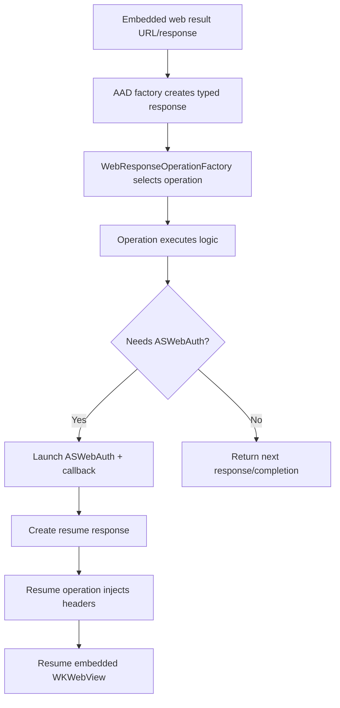

# MDM Onboarding Orchestration: Approach Comparison

## Problem statement

Mobile Onboarding introduces special in-flight redirects and response-header signals that must be handled during embedded web auth:

- Special redirect URLs:
  - `msauth://enroll`
  - `msauth://compliance`
  - `msauth://enrollment_complete`
- Response-header telemetry capture
- Header-driven handoff to `ASWebAuthenticationSession`

The design decision is where orchestration should live:

- **A) Delegate/navigation-time orchestration** (intercept in embedded webview delegate, then act immediately)
- **B) Response-object/factory-driven orchestration** (create typed responses in factory, then execute via operations)

---

## Functional requirements

1. Detect and handle `msauth://enroll` and `msauth://compliance` during embedded navigation.
2. Acquire BRT (bootstrap/refresh token used to continue onboarding flow) **once per redirect event** (no duplicate BRT fetch for the same redirect occurrence).
3. Build/load next request in the **same embedded `WKWebView` session**.
4. Capture response-header telemetry from navigation responses.
5. Perform ASWebAuth (`ASWebAuthenticationSession`) handoff **strictly when response headers indicate it**.
6. Support ASWebAuth callback URI schemes that are not constrained to a single fixed scheme.
7. Handle `msauth://enrollment_complete` as a terminal semantic outcome.

## Constraints

- Resume the **same embedded webview session** after intermediate actions whenever flow continues in-app.
- ASWebAuth callback scheme can be **any valid app-registered scheme**.
- Handoff decision must be **header-driven only** (not URL-guessing or heuristic branching).
- BRT acquisition must happen **once per redirect** (`enroll`/`compliance` occurrence).

---

## Existing pattern analysis (current codebase)

### Pattern 1: PKeyAuth in `MSIDAADOAuthEmbeddedWebviewController`

File: `MSAL/IdentityCore/IdentityCore/src/webview/embeddedWebview/MSIDAADOAuthEmbeddedWebviewController.m`

Observed behavior (navigation-action time):

- Detect special URL (`kMSIDPKeyAuthUrn`) in `decidePolicy...`
- Cancel navigation (`WKNavigationActionPolicyCancel`)
- Invoke handler (`[MSIDPKeyAuthHandler handleChallenge:...]`)
- Continue by loading returned request into the same embedded webview (`[self loadRequest:challengeResponse]`)

This is a direct precedent for **delegate-time interception + immediate same-session continuation**.

### Pattern 2: Switch-browser flow via response objects + operations

Files:

- `MSAL/IdentityCore/IdentityCore/src/webview/operations/MSIDSwitchBrowserOperation.m`
- `MSAL/IdentityCore/IdentityCore/src/webview/operations/MSIDSwitchBrowserResumeOperation.m`

Observed behavior:

- Factory/response pipeline creates `MSIDSwitchBrowserResponse`.
- `MSIDSwitchBrowserOperation` launches system web auth through `MSIDCertAuthManager`.
- Callback URL is converted to a new response and linked with `parentResponse`.
- `MSIDSwitchBrowserResumeOperation` validates state, injects `Authorization: Bearer ...`, and resumes embedded webview session.

This is a proven precedent for **typed response + operation-based orchestration** when server semantics are already modeled as response types.

---

## Approach A: Delegate / navigation-time orchestration

```mermaid
flowchart TD
    A[Embedded WKWebView navigation action/response] --> B{Special redirect or header signal?}
    B -- No --> C[Continue normal auth navigation]
    B -- msauth://enroll or msauth://compliance --> D[Cancel navigation]
    D --> E[Acquire BRT once for this redirect event]
    E --> F[Build next request URL + params/headers]
    F --> G[Load request into same WKWebView session]

    B -- Header indicates ASWebAuth --> H[Capture telemetry headers]
    H --> I[Start ASWebAuthenticationSession]
    I --> J[Receive callback URL (any registered scheme)]
    J --> K[Resume embedded flow/session as required]

    B -- msauth://enrollment_complete --> L[Emit terminal response outcome]
```

### Strengths

- Matches PKeyAuth precedent and webview delegate responsibilities.
- Natural place to consume navigation response headers.
- Lowest overhead for in-flight redirect handling.
- Simple guarantee of same-session continuation via direct `loadRequest` path.

### Risks

- Delegate path can become crowded if too many terminal semantics are embedded there.
- Requires disciplined state tracking to enforce “once per redirect” BRT acquisition.

---

## Approach B: Response-object / factory-driven orchestration



### Strengths

- Consistent with switch-browser architecture.
- Strongly typed response semantics.
- Good separation for terminal or explicit server-instruction outcomes.

### Risks

- For `enroll`/`compliance` + header-triggered decisions, this introduces extra transformation layers.
- Header-driven decisions become harder if headers must be carried into response creation paths not naturally bound to navigation-response callbacks.
- Higher risk of dual orchestration paths and state duplication.

---

## Side-by-side comparison

| Dimension | Approach A (Delegate-time) | Approach B (Response/Factory-time) |
|---|---|---|
| Fit for `msauth://enroll` / `msauth://compliance` mid-flight redirects | **Strong** | Medium |
| Fit for response-header telemetry + header-triggered handoff | **Strong** | Medium/Weak (extra plumbing) |
| Same `WKWebView` session continuation | **Direct** (`loadRequest`) | Indirect (operation resume path) |
| BRT once-per-redirect control | **Straightforward** at intercept site | Possible but more state plumbing |
| Complexity | **Lower** | Higher |
| Alignment to existing precedent | **PKeyAuth-like** | **Switch-browser-like** |
| Best use | In-flight navigation orchestration | Terminal semantic outcomes / typed server instructions |

---

## Recommendation

Use **Approach A as the primary orchestration model** for Mobile Onboarding.

### Boundary rules

1. Handle `msauth://enroll` and `msauth://compliance` in delegate/navigation-time orchestration.
2. Perform BRT acquisition once per redirect event at that interception point.
3. Apply response-header telemetry and header-driven ASWebAuth decision at navigation-response/delegate boundary.
4. Resume/continue in the same embedded `WKWebView` session where flow remains embedded.
5. Use response-object/factory handling only for **terminal outcomes**, e.g.:
   - `msauth://enrollment_complete`
   - final OAuth callback parsing/completion semantics

This preserves clarity and avoids forcing in-flight navigation mechanics into a response-object pipeline.

---

## Avoiding dual-path complexity

To avoid hard-to-debug split orchestration:

- Do **not** implement both delegate-time and response-object-time handling for `enroll`/`compliance`.
- Keep a single source of truth for redirect-event idempotency (BRT once-per-redirect).
- Keep ASWebAuth trigger policy strictly header-driven in one place.
- Reserve response objects for terminal semantics, not mid-flight navigation rewrites.

---

## Related examples/references

- Existing precedents in this repo:
  - `MSIDAADOAuthEmbeddedWebviewController` (PKeyAuth navigation-time interception)
  - `MSIDSwitchBrowserOperation` + `MSIDSwitchBrowserResumeOperation` (response-object + operation pattern)
- IdentityCore (common-for-objc) PR examples:
  - `AzureAD/microsoft-authentication-library-common-for-objc#1689` (example of redirect/header-driven onboarding behavior shaping in common layer)
  - `AzureAD/microsoft-authentication-library-common-for-objc#1782` (example of follow-up onboarding orchestration refinements in common layer)

These examples reinforce the recommended split: navigation-time orchestration for in-flight webview decisions, response objects for terminal semantic outcomes.
