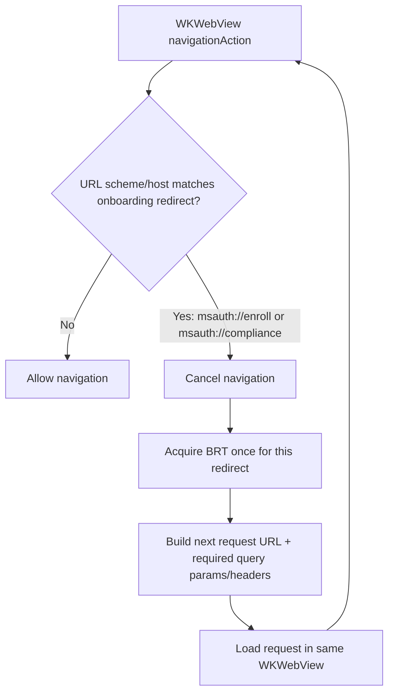
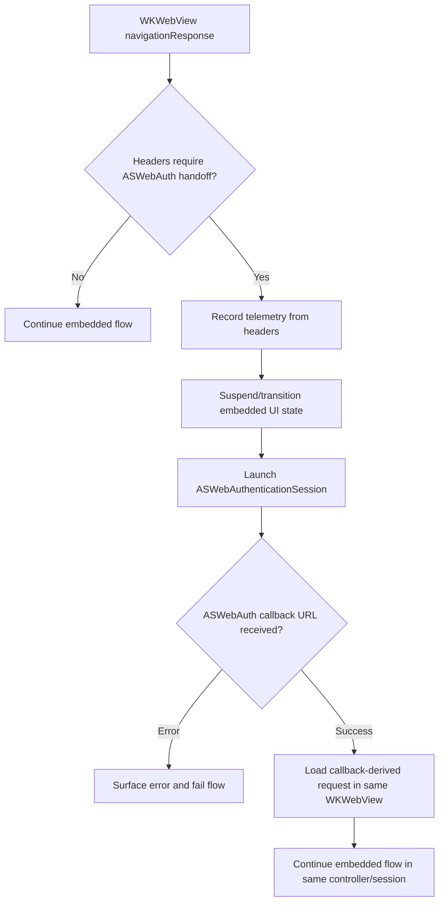
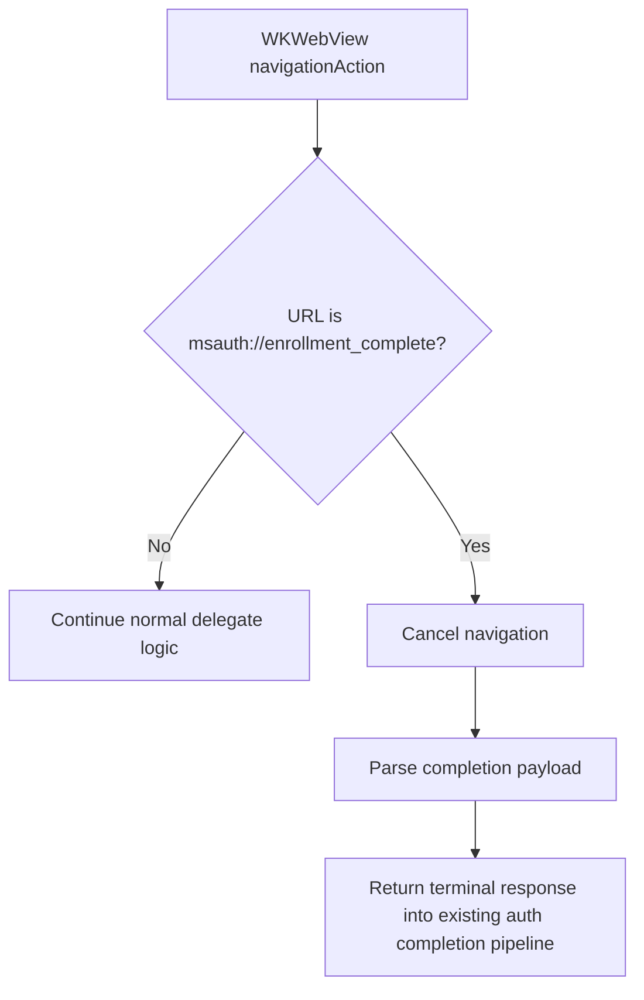

# MDM Onboarding Approach Comparison

## Problem

Mobile onboarding introduces redirect-style instructions that occur **mid-flow** during embedded web authentication:

- `msauth://enroll`
- `msauth://compliance`
- `msauth://enrollment_complete`

It also introduces response-header driven behavior (telemetry and potential system-browser handoff) while preserving a hard requirement:

> After external handling (including ASWebAuthenticationSession), resume the **same embedded WKWebView session**.

---

## Existing Patterns in MSAL

### Pattern 1: Response Object + Operation (Switch Browser)

Observed in:

- `MSIDSwitchBrowserOperation`
- `MSIDSwitchBrowserResumeOperation`

Characteristics:

- Typed response drives registered operation via `MSIDWebResponseOperationFactory`.
- Operation executes system-browser/cert-auth step.
- Callback URL is converted back into a webview response and continued.

Good fit when server returns an explicit semantic instruction that maps cleanly to a dedicated operation.

### Pattern 2: Navigation-Time Interception (PKeyAuth)

Observed in:

- `MSIDAADOAuthController` navigation delegate path for PKeyAuth challenge handling.

Characteristics:

- Detect special URL during navigation.
- Cancel navigation.
- Execute out-of-band logic.
- Resume by loading a new request in the **same embedded webview**.

Good fit for mid-flight redirect instructions that require transform/replace behavior.

---

## Approaches Considered

## Approach A (Recommended): Delegate/Navigation-Time Orchestration

Handle onboarding signals at webview delegate boundaries.

- Intercept `msauth://enroll` and `msauth://compliance` as navigation events.
- Cancel current navigation.
- Acquire BRT once per redirect.
- Build next request (query params + required headers).
- Load into the same `WKWebView`.
- Use `msauth://enrollment_complete` as terminal semantic completion.

### Why this is the best fit

- Matches existing PKeyAuth orchestration model.
- Naturally supports “cancel + replace navigation” behavior.
- Best aligns with requirement to continue in the **same embedded session**.
- Keeps flow-state logic near navigation boundaries where URL and headers are observed.

## Approach B: Force Through CompleteAuth / Response-Object Pipeline

Treat onboarding redirects as if they were terminal parse outcomes and re-enter via response-object operations.

### Risks

- Mid-flow continuation becomes harder to reason about.
- Higher chance of treating a continuation event like a terminal event.
- More plumbing to preserve same-webview semantics.
- Increased complexity and dual-path ownership for orchestration.

---

## Updated Flow Diagrams

### 1) Intercept enroll/compliance redirects and continue in same embedded session

### 2) Header-driven ASWebAuth handoff with resume to same embedded webview

### 3) Enrollment completion as semantic terminal response

---

## Decision

Adopt **Approach A** as the primary architecture for MDM onboarding:

1. Use delegate/navigation-time interception for `msauth://enroll` and `msauth://compliance`.
2. Keep onboarding continuation logic in controller/delegate layer to preserve same `WKWebView` session.
3. Trigger ASWebAuth from header observations in delegate response handling, then resume same embedded session.
4. Use response-object/operation path for true semantic completion states (including `msauth://enrollment_complete`) rather than for mid-flight continuation redirects.

This yields consistency with the proven PKeyAuth model while preserving modularity where terminal semantic responses are appropriate.
