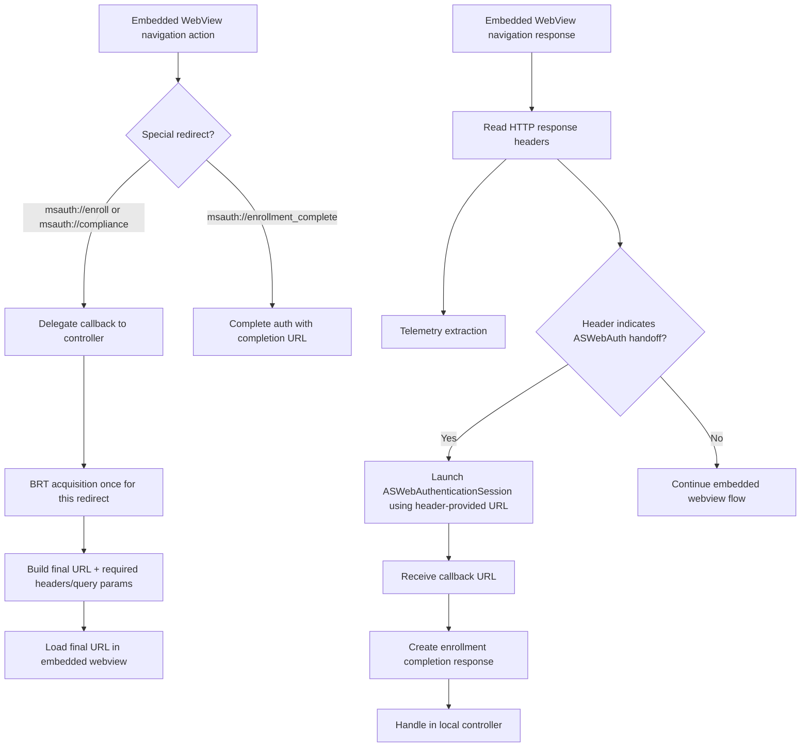
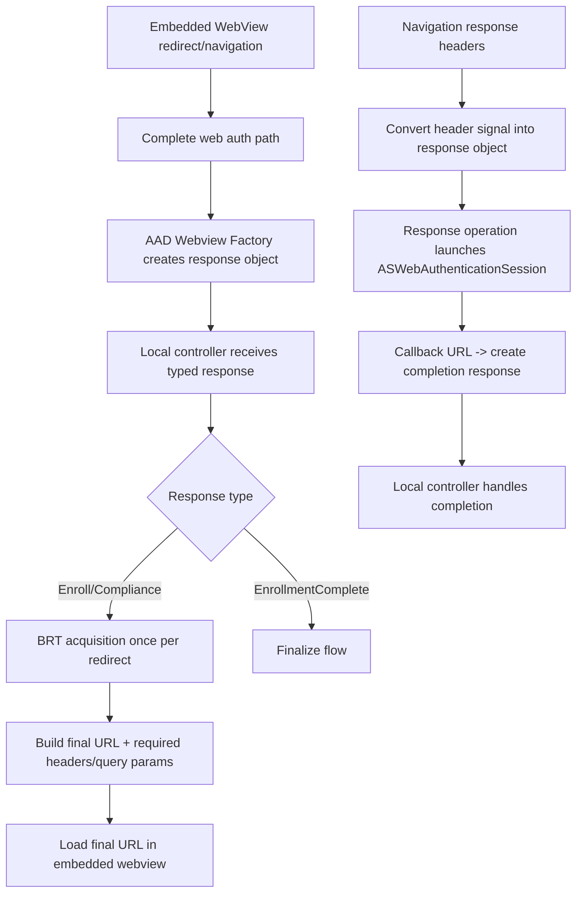

# Mobile Onboarding Orchestration: Delegate vs Response-Object Approaches

## Purpose

This document compares two orchestration approaches for **Mobile Onboarding** and recommends one for the following requirements:

1. Handle special redirect URLs:
   - `msauth://enroll`
   - `msauth://compliance`
   - `msauth://enrollment_complete`
   where **BRT acquisition happens once per redirect**, then the final URL is loaded with required headers/query parameters.
2. Analyze response headers for telemetry and perform **ASWebAuthenticationSession handoff only when response headers require it** (handoff URL/scheme can be anything; trigger is strictly header-driven).

## Approaches Compared

### A) Delegate/navigation-time orchestration

- Intercept redirect/navigation events in embedded webview controller.
- Forward to controller delegate for policy/orchestration.
- Perform BRT acquisition and URL reconstruction at interception time.
- Inspect HTTP response headers at navigation-response time and trigger ASWebAuthenticationSession when header condition is present.

### B) Response-object/factory-driven orchestration

- Allow redirects to complete and convert into typed response objects via webview factory.
- Handle responses in local controller + response operation pipeline.
- Perform BRT acquisition and final URL construction after response object creation.
- For header-driven handoff, first transform headers to a response object, then invoke operation to launch ASWebAuthenticationSession.

## Flow Diagrams

### A) Delegate/navigation-time orchestration

### B) Response-object/factory-driven orchestration

## Requirement-by-Requirement Analysis

### 1) Special redirects (`enroll`, `compliance`, `enrollment_complete`) with one-time BRT per redirect

- `msauth://enroll` and `msauth://compliance` are **navigation-time control directives**, not final auth completion outputs.
- Handling these at interception time (Approach A) keeps orchestration immediate and deterministic:
  - cancel current navigation,
  - acquire BRT once,
  - reconstruct/load final URL with required headers/query parameters.
- In Approach B, converting mid-navigation directives into terminal response semantics adds extra lifecycle coupling and indirection.

### 2) Header-driven telemetry + ASWebAuthenticationSession handoff

- Trigger is explicitly **header-driven** and must be evaluated from `WKNavigationResponse`/HTTP headers.
- Approach A naturally evaluates headers exactly where they are available (navigation response callback).
- Approach B requires additional plumbing (headers -> factory signal -> response object -> operation), which increases moving parts and failure surface.
- Since handoff URL/scheme can be anything, the activation condition must remain header-based, not URL-scheme-based.

## Comparison Table

| Dimension | Delegate / Navigation-Time | Response-Object / Factory-Driven |
|---|---|---|
| Fit for `msauth://enroll` and `msauth://compliance` | Strong (native navigation interception semantics) | Weaker (forces redirects into response lifecycle) |
| One-time BRT per redirect enforcement | Straightforward at point of interception | Possible, but distributed across response handling layers |
| Header-driven ASWebAuth trigger | Strong (headers available directly in navigation-response path) | Indirect (requires header translation into response type) |
| Telemetry timing/accuracy | Immediate at response-header read point | Depends on additional transformation path |
| Complexity | Lower orchestration overhead | Higher object/operation plumbing complexity |
| Extensibility for terminal outcomes | Good | Very good |
| Risk of flow ambiguity | Lower | Higher when mixing mid-flow redirects with terminal responses |

## Recommendation

Use **Delegate/navigation-time orchestration as the primary Mobile Onboarding approach**.

### Why this is the best fit for the requirements

1. Correct abstraction: special onboarding redirects are navigation directives, so navigation-time interception is the cleanest model.
2. Header-driven handoff naturally belongs in navigation-response handling.
3. Lower complexity and fewer transition points for high-sensitivity onboarding flows.
4. Deterministic enforcement of “BRT acquisition once per redirect”.

### Boundary for response-object usage

Keep response-object/factory-driven orchestration for **terminal semantic outcomes** (e.g., completion responses/standard callback parsing), not for primary handling of onboarding mid-flow redirects or header-trigger detection.

## Decision

- **Chosen primary approach:** Delegate/navigation-time orchestration
- **Secondary use:** Response-object/factory for terminal completion semantics only

## References

- Related implementation discussions:
  - https://github.com/AzureAD/microsoft-authentication-library-common-for-objc/pull/1782
  - https://github.com/AzureAD/microsoft-authentication-library-common-for-objc/pull/1689
