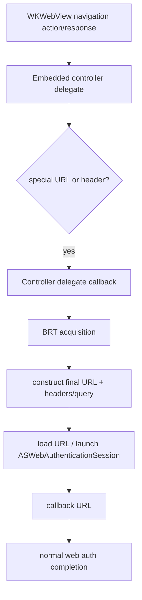
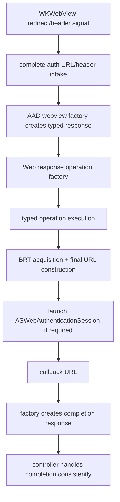

# Mobile Onboarding orchestration: delegate-first vs response-pipeline

## Problem statement

Mobile Onboarding needs to support two requirements in a single interactive web flow:

1. Handle special redirect URLs:
   - `msauth://enroll`
   - `msauth://compliance`
   - `msauth://enrollment_complete` (alias: `msauth://in_app_enrollment_complete`)
2. Inspect HTTP response headers for telemetry and handoff signals, and open `ASWebAuthenticationSession` when headers indicate a system-web handoff is required.

The design decision is where orchestration should live:

- **Pattern A**: delegate/navigation-time orchestration (embedded webview delegates perform onboarding branching directly)
- **Pattern B**: response-object/factory-driven orchestration (URL/header signals become typed responses, then operations/controllers orchestrate)

## Existing patterns in this repository

### Response + operation pipeline (existing, mature)

The current interactive flow already uses a response/operation pipeline:

- URL -> typed response in factory (`MSIDAADWebviewFactory`)
- response -> typed operation (`MSIDWebResponseOperationFactory`)
- operation invoked from request/controller path (`MSIDInteractiveAuthorizationCodeRequest`)

Relevant examples:

- `MSIDSwitchBrowserResponse` + `MSIDSwitchBrowserOperation`
- `MSIDSwitchBrowserResumeResponse` + `MSIDSwitchBrowserResumeOperation`
- `MSIDWebOpenBrowserResponse` + `MSIDWebOpenBrowserResponseOperation`

This pipeline already handles `ASWebAuthenticationSession` style transitions via operation logic (`MSIDSwitchBrowserOperation` using `MSIDCertAuthManager`).

### Delegate interception patterns (existing, purpose-specific)

Embedded controllers intercept navigation/challenges early:

- `MSIDAADOAuthEmbeddedWebviewController decidePolicyAADForNavigationAction:`
- PKeyAuth handling via `MSIDPKeyAuthHandler`
- response-header callback hook via `navigationResponseBlock` in `MSIDOAuth2EmbeddedWebviewController`

These delegate patterns are effective for **immediate webview policy/challenge handling** (e.g., PKeyAuth), where decision must happen before normal completion pipeline.

## Approach A: delegate/navigation-time orchestration

### Strengths

- Earliest possible interception point.
- Direct access to `WKNavigationAction` / `WKNavigationResponse` objects.
- Familiar for PKeyAuth-like challenges.

### Weaknesses

- Business orchestration moves into navigation delegates (layer mixing).
- Harder to reason about ordering across async delegate callbacks.
- Header-driven and URL-driven logic can fragment across multiple delegates.
- Higher risk of duplicate paths with existing response pipeline.

## Approach B: response-object/factory-driven orchestration

### Strengths

- Aligns with existing architecture used by switch-browser.
- Keeps orchestration in response/operation layer (better separation of concerns).
- Easier unit-testing at response/operation boundaries.
- Better extensibility for additional Mobile Onboarding actions/headers.
- Lower long-term risk of dual-path drift.

### Weaknesses

- Requires modeling new response types and operation wiring.
- Needs disciplined boundary so delegates do not re-implement orchestration.

## Comparison

| Dimension | Pattern A: delegate-first | Pattern B: response-pipeline |
|---|---|---|
| Timing correctness | Earliest interception, but async delegate ordering complexity | Slightly later, but deterministic pipeline sequencing |
| Header availability | Direct in `decidePolicyForNavigationResponse` | Available if converted into typed response input; easier to centralize |
| Layering | Mixes policy + orchestration in UI delegate layer | Preserves layering (parse -> response -> operation -> controller) |
| Testability | UI delegate-heavy tests, higher mocking burden | Focused unit tests for factory/response/operation state transitions |
| Extensibility | Tends to add more delegate branches over time | Additive new response/operation classes with localized impact |
| Risk | High risk of dual logic paths and regressions | Lower risk when single orchestration path is enforced |

## Recommendation

**Choose Pattern B (response-object/factory-driven orchestration) as the primary Mobile Onboarding design.**

Why:

1. It matches the repository’s established switch-browser architecture and avoids introducing a second orchestration model for similar behavior.
2. It provides cleaner boundaries for URL/header parsing, BRT handling, and `ASWebAuthenticationSession` handoff.
3. It is more maintainable and testable as onboarding actions evolve.

## Boundary guidance (to avoid dual-path complexity)

Use this strict split:

- **Delegates (embedded webview)**: only immediate webview policy/challenge concerns (e.g., PKeyAuth, navigation allow/cancel, data collection hooks).
- **Factory/response/operation/controller pipeline**: all Mobile Onboarding orchestration decisions:
  - classify onboarding URLs and handoff headers
  - trigger BRT acquisition
  - build/load final URLs with required headers/query params
  - open and resume `ASWebAuthenticationSession`
  - process enrollment completion response

Do **not** duplicate onboarding business logic in both delegate callbacks and response operations.

## Risk notes

- If both patterns run for the same signal, race/duplication can occur (double loads, duplicate BRT attempts, mismatched completion handling).
- Header-triggered handoff should have one canonical parsing/decision point to keep telemetry reliable.

## References

- Existing response/operation pattern in this repo (IdentityCore submodule), especially switch-browser:
  - `MSIDSwitchBrowserResponse` / `MSIDSwitchBrowserOperation`
  - `MSIDWebResponseOperationFactory`
  - `MSIDInteractiveAuthorizationCodeRequest`
- Existing delegate interception examples in this repo (IdentityCore submodule):
  - `MSIDAADOAuthEmbeddedWebviewController` (navigation interception + PKeyAuth hook)
  - `MSIDOAuth2EmbeddedWebviewController` (`navigationResponseBlock` for response headers)
- Common-for-objc PRs used as Mobile Onboarding references/examples:
  - https://github.com/AzureAD/microsoft-authentication-library-common-for-objc/pull/1689
  - https://github.com/AzureAD/microsoft-authentication-library-common-for-objc/pull/1782
