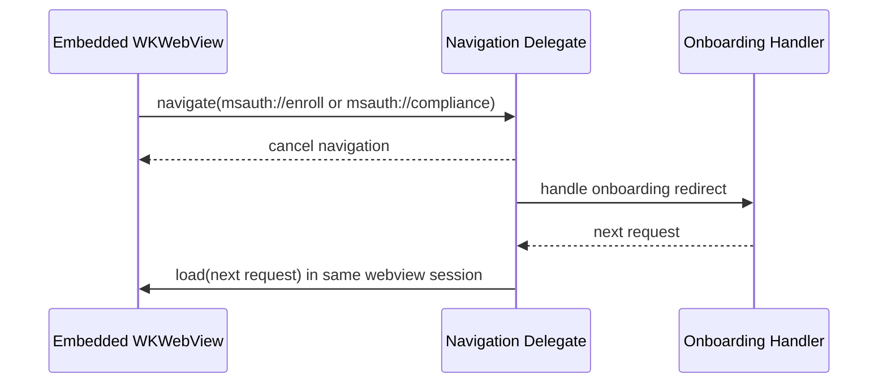
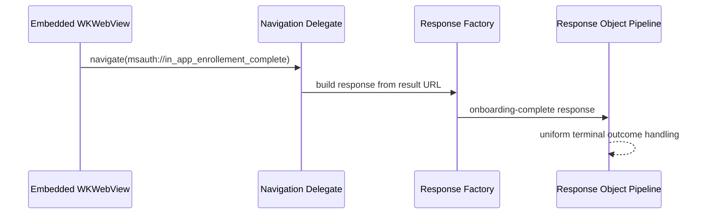

# Mobile Onboarding: Orchestration Approach Comparison (Delegate vs Response-Object)

## Status

Draft / Design exploration

## Requirements & Constraints

### Functional Requirements

1. Special redirect URL handling:
   - `msauth://enroll`
   - `msauth://compliance`
   - `msauth://in_app_enrollement_complete` (exact callback URL; spelling is intentional and must be preserved exactly for protocol compatibility)

2. Interception behavior:
   - `msauth://enroll` and `msauth://compliance` are intercepted at navigation-time in the embedded webview delegate.
   - Navigation is cancelled, required work (for example, BRT acquisition and request shaping) is performed, then flow resumes in the same `WKWebView`.

3. Enrollment completion behavior:
   - `msauth://in_app_enrollement_complete` is **not** treated as an immediate terminate-now signal in the navigation delegate.
   - Instead, it propagates to a response object so completion is handled through the same response pipeline used for other terminal outcomes.

## Diagrams

### Navigation-time interception for enroll/compliance

### Enrollment-complete propagation via response object

## Boundary Rules

- Delegate/navigation layer owns mid-flight continuation events:
  - `msauth://enroll`
  - `msauth://compliance`

- Response-object layer owns semantic completion events:
  - `msauth://in_app_enrollement_complete`

- `msauth://in_app_enrollement_complete` must be handled via the response object path for consistent outcome handling and should not be intercepted for immediate termination in delegate logic.
