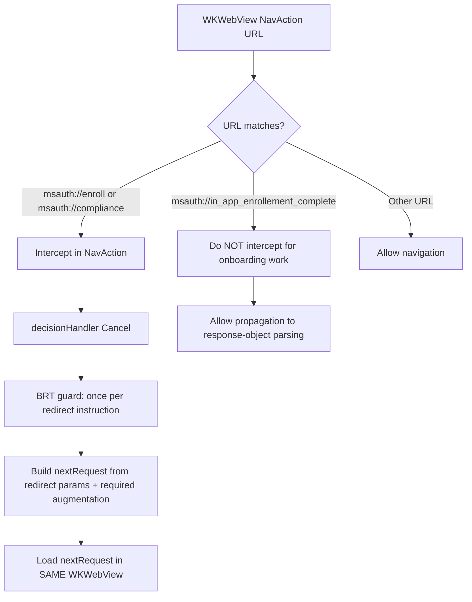
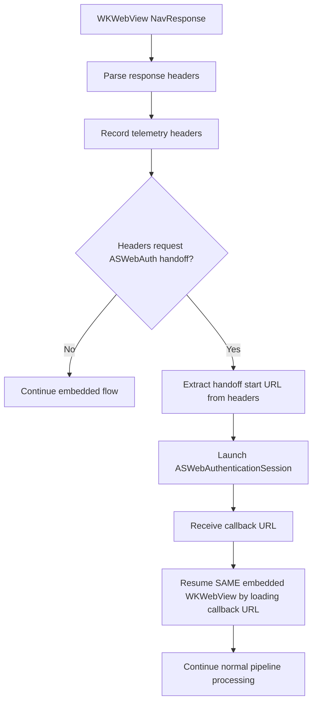

# Mobile Onboarding: Orchestration Approach Comparison (Delegate vs Response-Object)

## Status

Finalized design decision

## Summary (Recommendation)

For Mobile Onboarding in embedded `WKWebView`, use **Approach A (delegate-led orchestration)** for mid-flight handling and keep response-object parsing for terminal outcomes.

- Intercept `msauth://enroll` and `msauth://compliance` at navigation-time (`decidePolicyForNavigationAction`).
- For each intercepted redirect instruction: **Cancel → BRT guard (once per redirect instruction) → build `nextRequest` → load in same `WKWebView`**.
- Use navigation-response handling for header telemetry and header-driven handoff decisions.
- **Do not intercept** completion callback URL `msauth://in_app_enrollement_complete` at navigation-time for onboarding work.
- Allow `msauth://in_app_enrollement_complete` to propagate to response-object parsing for uniform final outcome handling.

This keeps mid-flight control deterministic while preserving existing response-object semantics for completion parsing.

## Finalized callback URL

The canonical enrollment completion callback URL for this design is:

- `msauth://in_app_enrollement_complete`

Notes:

- Use this exact value (including spelling) consistently in Mobile Onboarding docs/design.
- `msauth://in_app_enrollement_complete` is **not** a navigation-time onboarding interception target.
- `msauth://enroll` and `msauth://compliance` **are** navigation-time onboarding interception targets.

## Problem statement

During interactive authentication in an embedded `WKWebView`, Mobile Onboarding introduces mid-flight instructions that require deterministic orchestration:

1. Special redirect URLs:
   - `msauth://enroll`
   - `msauth://compliance`
   - `msauth://in_app_enrollement_complete`
2. BRT acquisition once per redirect instruction before continuing web flow.
3. Response-header telemetry collection.
4. Header-driven `ASWebAuthenticationSession` handoff.
5. Resume into the **same embedded `WKWebView`** session by loading the callback URL returned from system web auth.

## Requirements and constraints

### Functional requirements

1. **NavAction URL handling**
   - Intercept `msauth://enroll` and `msauth://compliance`.
   - Sequence: cancel navigation, run one-time-per-instruction BRT guard, build next request, load in same webview.

2. **Completion callback handling**
   - `msauth://in_app_enrollement_complete` must continue through normal parsing pipeline.
   - No onboarding interception at navigation-time for this URL.

3. **Header processing in NavResponse**
   - Parse/record telemetry headers whenever responses are available.
   - Detect header-driven handoff instruction and required start URL.

4. **ASWebAuth handoff/resume**
   - Start `ASWebAuthenticationSession` only when response headers instruct it.
   - On callback, resume same embedded session by loading callback URL into same `WKWebView`.

### Non-functional requirements

- Deterministic timing (mid-flight logic at navigation boundaries).
- Single ownership of decisions (avoid duplicate decision paths).
- Testable boundaries (URL classification, BRT one-time guard, header parsing).

## Existing pattern analysis in repository

### Pattern 1: PKeyAuth (delegate / navigation-time)

PKeyAuth handling in webview delegates uses the same architectural shape needed by onboarding redirects:

- detect special challenge URL in navigation flow,
- cancel default navigation,
- produce challenge response request,
- resume by loading request in same embedded webview.

This validates delegate-level interception for mid-flight protocol instructions.

### Pattern 2: Switch-browser (response-object + operation)

Switch-browser flow demonstrates response-object driven operation and callback translation:

- response type binds to operation,
- operation launches external/system auth,
- callback is transformed into pipeline response.

This pattern fits terminal or semantic outcomes, but using it for every mid-flight onboarding redirect would increase timing ambiguity and state complexity.

## Approaches compared

### Approach A (recommended): Delegate-led orchestration + response-object completion

- `msauth://enroll` / `msauth://compliance`: handled in NavAction.
- header telemetry and header-driven handoff: handled in NavResponse.
- `msauth://in_app_enrollement_complete`: parsed in response-object pipeline.

### Approach B (not recommended): Push all orchestration into response-object stage

- Delays decision points that are naturally navigation-time concerns.
- Risks duplicated state transitions between delegate and pipeline layers.
- Makes one-time BRT gating and same-webview continuation harder to reason about.

## Comparison table

| Criterion | Approach A: Delegate-led | Approach B: Response-object-first |
|---|---|---|
| Mid-flight redirect timing (`enroll`/`compliance`) | Natural fit (NavAction) | Late/indirect |
| BRT once per redirect instruction | Straightforward guard at interception point | Extra state plumbing required |
| Header telemetry timing | Natural fit (NavResponse) | Requires deferred mapping |
| Header-driven ASWebAuth launch | Direct from response metadata | Additional translation layer |
| Resume same embedded `WKWebView` | Explicit and local | More cross-layer coupling |
| Completion consistency | Preserved via response-object parsing | Preserved, but at cost of orchestration complexity |
| Overall complexity | Lower | Higher |

## Diagram A1: NavAction URL handling

## Diagram A2: NavResponse header telemetry + header-driven ASWebAuth handoff

## Boundary rules (authoritative)

1. `msauth://enroll` and `msauth://compliance` are **NavAction interception** concerns.
2. `msauth://in_app_enrollement_complete` is **not intercepted for onboarding work at navigation-time**.
3. `msauth://in_app_enrollement_complete` **must propagate to response-object parsing** for uniform completion handling.
4. Header telemetry and header-driven ASWebAuth trigger decision are **NavResponse** concerns.
5. After ASWebAuth callback, resume by loading callback URL into the **same embedded `WKWebView`**.

## References

- `MSAL/IdentityCore/src/webview/embeddedWebview/challenge/MSIDPKeyAuthHandler.*`
- `MSAL/IdentityCore/src/oauth2/operations/MSIDSwitchBrowserOperation.*`
- `MSAL/IdentityCore/src/oauth2/operations/MSIDSwitchBrowserResumeOperation.*`
- `MSAL/IdentityCore/src/oauth2/MSIDWebResponseOperationFactory.*`

