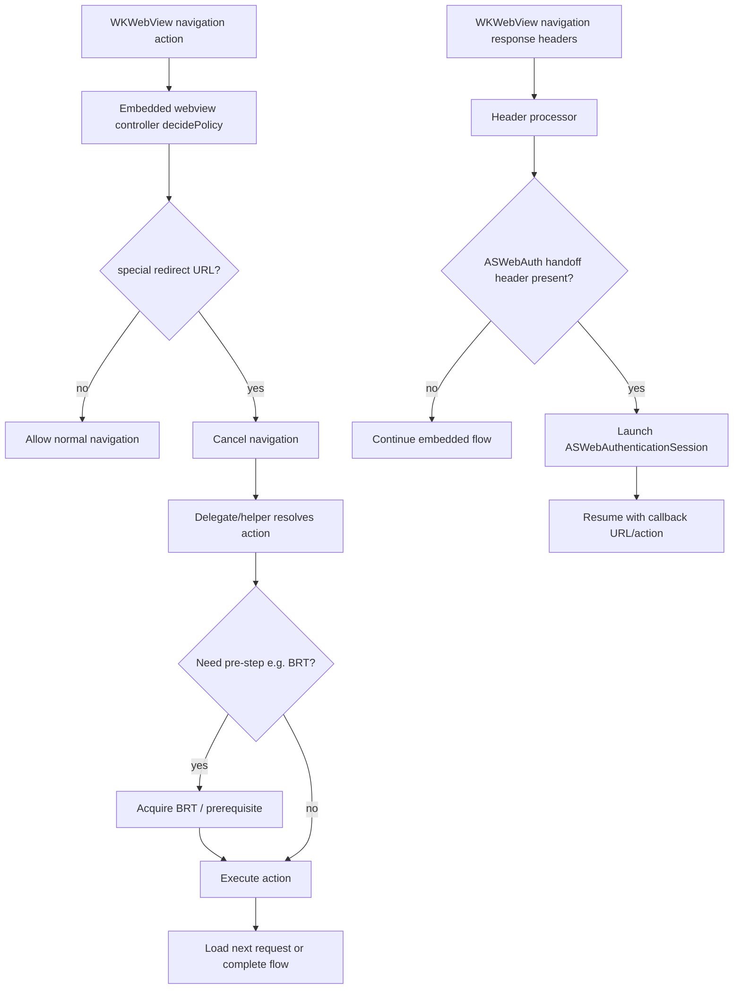
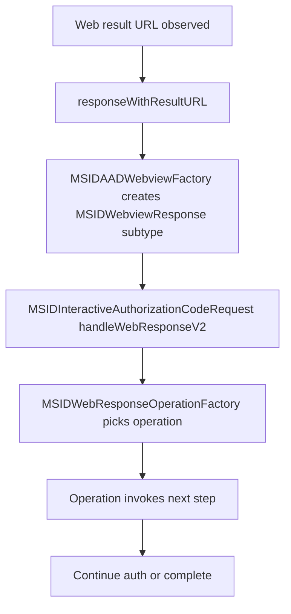

# MDM onboarding orchestration approach comparison

## Problem statement and requirements

We need a clear orchestration model for embedded webview MDM onboarding that covers:

1. Interception/handling of special redirect URLs used by onboarding flows:
   - `msauth://enroll`
   - `msauth://compliance`
   - `msauth://in_app_enrollment_complete`
2. Processing of navigation **response headers** for telemetry and ASWebAuthenticationSession handoff signaling.
3. A model that is maintainable and aligned with existing IdentityCore/MSAL interactive web response handling.

## Current repo pattern re-analysis (dev branch)

### Existing navigation interception hooks

- Embedded webview policy interception exists in:
  - `MSAL/IdentityCore/IdentityCore/src/webview/embeddedWebview/MSIDOAuth2EmbeddedWebviewController.m`
  - `MSAL/IdentityCore/IdentityCore/src/webview/embeddedWebview/MSIDAADOAuthEmbeddedWebviewController.m`
- `MSIDAADOAuthEmbeddedWebviewController` already intercepts `msauth://` and `browser://` and can delegate browser-style challenge handling via `externalDecidePolicyForBrowserAction`.
- A response-header callback surface exists (`navigationResponseBlock`) in `MSIDOAuth2EmbeddedWebviewController`, but is not currently wired to a central header-driven ASWebAuth handoff path.

### Existing response-object/factory/operation pipeline

- URL -> response-object creation:
  - `MSIDAuthorizeWebRequestConfiguration.responseWithResultURL(...)`
  - `MSIDAADWebviewFactory.oAuthResponseWithURL(...)`
- Response-object -> operation orchestration:
  - `MSIDInteractiveAuthorizationCodeRequest.handleWebResponseV2(...)`
  - `MSIDWebResponseOperationFactory`
  - operations such as `MSIDSwitchBrowserOperation` / `MSIDSwitchBrowserResumeOperation`.
- This is the established extensibility pattern for semantic web outcomes in the current codebase.

### Relevant special redirect behavior already present

- Existing special redirects already mapped in factory/response parsing include broker/switch-browser and JIT troubleshooting shapes (for example `msauth://compliance_status?...`).
- The exact MDM onboarding redirect hosts listed above (`enroll`, `compliance`, `in_app_enrollment_complete`) are not yet a first-class, centralized orchestration path in `dev`.
- Header-driven ASWebAuthenticationSession handoff via dedicated response headers is also not yet centralized in current `dev` code.

## Approach A: delegate/navigation-action orchestration

## Approach B: response-object/factory-driven orchestration

## Comparison

| Dimension | Delegate/navigation-action | Response-object/factory-driven |
|---|---|---|
| Best fit | Mid-navigation policy decisions | Semantic/typed web outcomes |
| Special redirects (`msauth://enroll`, `msauth://compliance`) | Natural fit (cancel + replace request/action) | Possible, but can blur completion-vs-navigation boundaries |
| `msauth://in_app_enrollment_complete` | Can be handled, but often cleaner as semantic completion | Natural fit as typed completion response |
| Response-header-driven ASWebAuth handoff | Natural fit when headers are observed in navigation response callbacks | Requires plumbing headers through factory/result pathways |
| Layering clarity | Keeps webview policy in webview/delegate layer | Keeps typed result interpretation in response/operation layer |
| Alignment with current `dev` architecture | Partially present via webview interception hooks | Strongly present (`responseWithResultURL` + operation factory) |
| Test shape | URL/header -> action unit tests | URL -> response type + operation tests |

## Recommendation and rationale

Use a **hybrid with clear boundaries**:

1. **Primary orchestration for MDM redirect instructions:** delegate/navigation-action path.
   - Use this for `msauth://enroll` and `msauth://compliance` because these are navigation-time instructions.
2. **ASWebAuthenticationSession handoff trigger:** response-header-driven handling in the same navigation layer.
   - Response headers are naturally available at `WKNavigationResponse` time.
3. **Response-object/factory path remains canonical for semantic completion outcomes.**
   - Continue using factory + operation patterns for typed outcomes, including completion-like redirects such as `msauth://in_app_enrollment_complete`.

This keeps responsibility boundaries explicit, avoids duplicating orchestration logic, and fits the existing IdentityCore architecture.

## Alignment with existing repo patterns

- This recommendation intentionally aligns with existing `MSIDSwitchBrowserResponse` + `MSIDSwitchBrowserOperation` style handling for semantic outcomes.
- It also preserves the current `MSIDInteractiveAuthorizationCodeRequest` v2 response/operation flow as the typed-outcome engine.
- The main addition implied by this design direction is a centralized delegate/helper layer for:
  - special MDM redirect URL action resolution, and
  - response-header-driven ASWebAuthenticationSession handoff.

## Summary

- **Do not force all MDM onboarding behavior into one layer.**
- Use **delegate/navigation-action** for navigation-time redirect instructions and header-triggered ASWebAuth handoff.
- Use **factory/response/operation** for semantic completion outcomes and existing typed response handling.
- This provides the clearest, lowest-risk evolution path from the current `dev` architecture.
