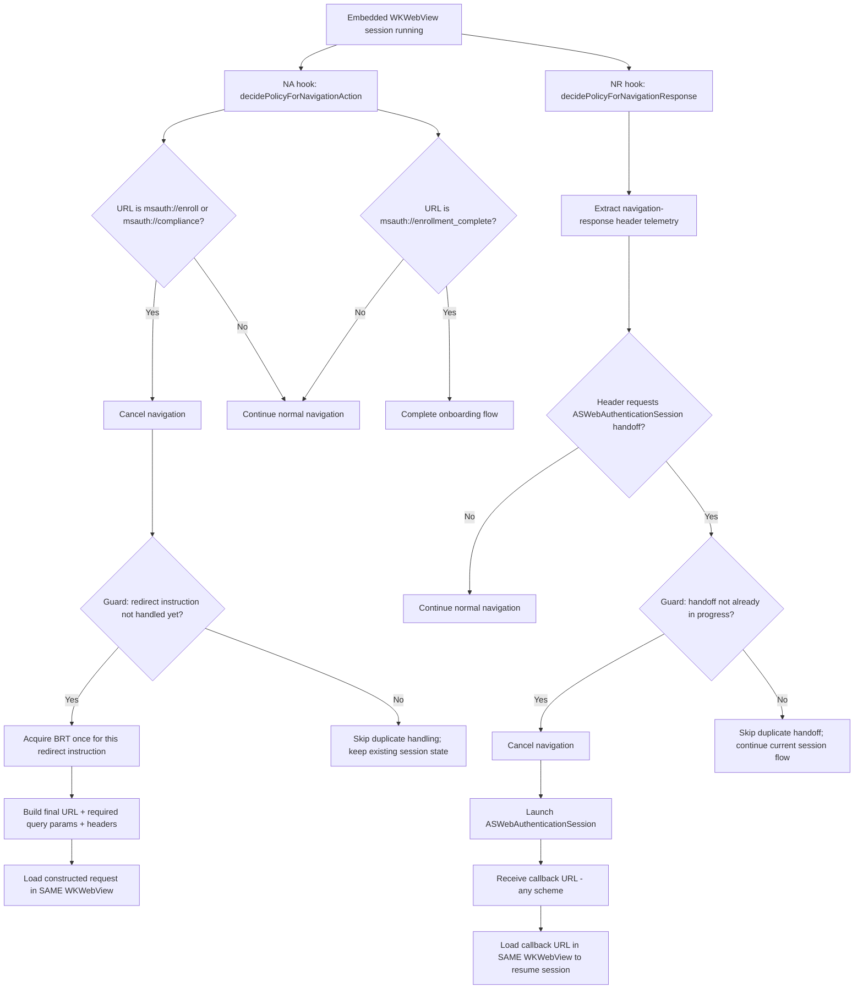
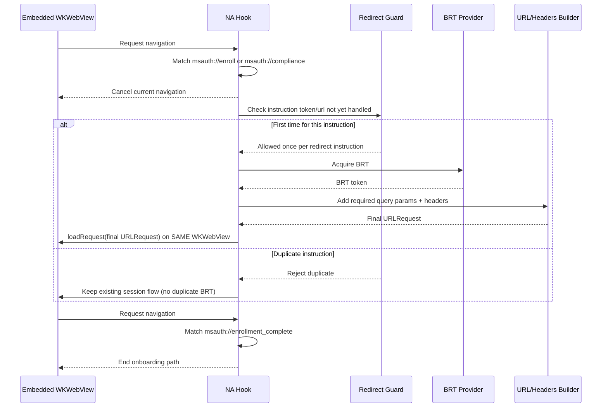
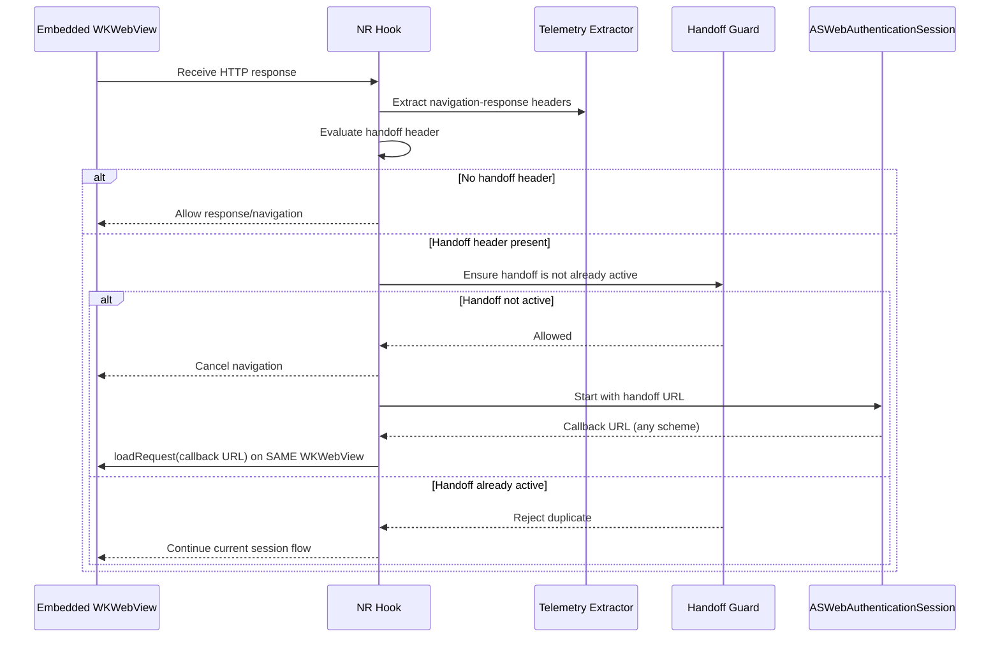

# Mobile Onboarding Approach Comparison

This document compares orchestration points for Mobile Onboarding and clarifies the required flow handling.

## Legend

- **NA** = `WKNavigationDelegate` navigation-action hook (`decidePolicyForNavigationAction`) before request execution
- **NR** = `WKNavigationDelegate` navigation-response hook (`decidePolicyForNavigationResponse`) after HTTP response receipt, before rendering
- **Guard** = per-session/per-instruction state check to prevent duplicate or invalid handling

## Hook Boundaries (NA vs NR)

## Redirect Interception and Resume (Navigation-Action)

## Header-Driven ASWebAuth Handoff and Resume (Navigation-Response)

## Conclusion and Recommendation

Keep the conclusion/recommendation unchanged: use **delegate/navigation-time orchestration (Approach A)** as the primary architecture for Mobile Onboarding.

- Use **navigation-action** interception for `msauth://enroll`, `msauth://compliance`, and `msauth://enrollment_complete` redirect handling.
- Use **navigation-response** handling for response-header telemetry extraction and header-driven `ASWebAuthenticationSession` handoff.
- Always resume by loading into the **same embedded `WKWebView` session** after BRT-based redirect handling or ASWebAuth callback.
