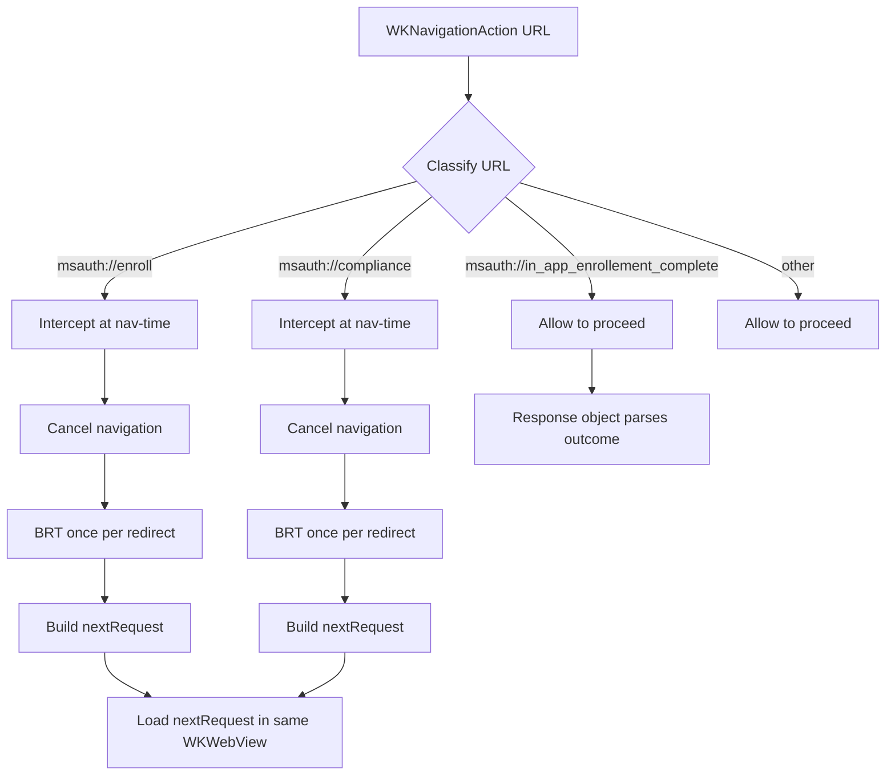

# Mobile Onboarding: Orchestration Approach Comparison (Delegate vs Response-Object)

## Status

Draft / Design exploration

## Summary (Recommendation)

For **Mobile Onboarding** in an embedded `WKWebView` flow that must:

- intercept **special redirect URLs** (e.g., `msauth://enroll`, `msauth://compliance`),
- perform **BRT acquisition once per redirect** before continuing,
- analyze **HTTP response headers** for telemetry and to trigger **header-driven ASWebAuthenticationSession (ASWebAuth) handoff**, and
- **resume the same embedded WKWebView session** after the handoff,

the recommended orchestration is:

> **Approach A: Delegate + navigation-time orchestration** as the primary architecture.

Use response objects (factory-driven) for **terminal/semantic outcomes** (e.g., `msauth://in_app_enrollement_complete`, final OAuth redirect parsing). Do not intercept `msauth://in_app_enrollement_complete` for immediate termination in navigation-time logic.

---

## Problem Statement

Mobile Onboarding introduces **mid-flight** instructions during an interactive, web-based authentication session hosted in an embedded `WKWebView`. During this interactive session, the client must:

1. Detect and handle **special redirect URLs**:
   - `msauth://enroll`
   - `msauth://compliance`
   - `msauth://in_app_enrollement_complete`
2. Perform **BRT (broker refresh token) acquisition** **once per redirect instruction** before continuing the web flow.
3. Parse and record **telemetry** from **HTTP response headers**.
4. If response headers indicate an **ASWebAuth handoff**, launch `ASWebAuthenticationSession` and, upon completion, **resume the same embedded `WKWebView` session** by loading the returned callback URL (callback scheme may be anything: custom scheme, https, etc.).

The key design question is where to place orchestration:

- at the webview boundary (navigation-time delegates), or
- in completion-time “response object + operation” pipelines.

---

## Requirements & Constraints

### Functional Requirements

1. **Special redirect URL handling**
   - Detect: `msauth://enroll`, `msauth://compliance`, `msauth://in_app_enrollement_complete`.
   - For `enroll` / `compliance`:
     - cancel/override default navigation,
     - perform **BRT acquisition once per redirect**,
     - compute the next URL from query params and add required query params/headers,
     - load the resulting request into the **same embedded `WKWebView`**.
   - For `msauth://in_app_enrollement_complete`:
     - allow navigation-time classification to pass it through to normal response parsing,
     - produce completion outcome via response object handling for uniform outcome processing.

2. **Response header processing**
   - Collect telemetry from response headers at the time they are available.
   - Detect **header-driven** ASWebAuth handoff and initiate it when required.

3. **ASWebAuth handoff**
   - Trigger is **strictly header-driven**.
   - Start URL may be provided by headers.
   - Callback URL scheme can be anything.
   - On completion, callback must be **loaded back into the same embedded `WKWebView` session**.

### Non-Functional Requirements

- Deterministic behavior: mid-flight redirects must be handled at the correct moment.
- Clear ownership of state and decisions.
- Avoid “dual-path” logic (don’t implement the same decision in two places).
- Testable: URL classification, header parsing, one-time BRT acquisition gating.

---

## Approach A: Delegate + Navigation-Time Orchestration (Recommended)

### NavAction URL Classification

### Decision Rules

- `msauth://enroll` and `msauth://compliance` are **navigation-time intercepted** and canceled.
- For each intercepted redirect, orchestration is:
  - cancel navigation,
  - perform BRT acquisition once per redirect instruction,
  - build next request,
  - load next request in the same `WKWebView`.
- `msauth://in_app_enrollement_complete` is **not canceled for onboarding work** at navigation-time.
- `msauth://in_app_enrollement_complete` is handled downstream through response-object parsing to keep completion handling uniform with other terminal outcomes.

---

## Boundary Rules (Delegate vs Response Object)

- **Delegate (navigation-time boundary):**
  - Owns only mid-flight control redirects requiring immediate orchestration:
    - `msauth://enroll`
    - `msauth://compliance`
  - Performs intercept/cancel + BRT + next-request reload in same webview.

- **Response-object boundary:**
  - Owns terminal semantic outcomes and normalized result handling.
  - `msauth://in_app_enrollement_complete` is explicitly handled here (via response object), not by immediate navigation-time termination.

This boundary keeps `WKWebView` orchestration deterministic while preserving a single outcome-handling path.
